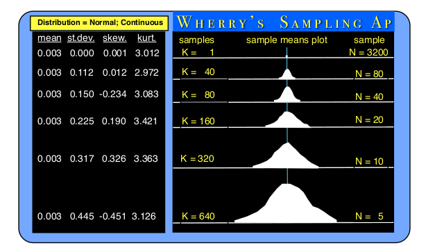

# SamplingApp

- The main purpose of the “Sampling” application is to enhance the understanding of the results that occur when various types of distributions are randomly sampled. Such understanding is especially needed for those who do experimental research and need to compare the results of having treated two or more groups differently, and need to be able to appreciate whether any differences found might have happened by chance alone.
&nbsp;

- The concept of **“sampling”** in research always begins with the idea of some **“population of interest”** (or domain of interest) to the researcher. This population of interest to the researcher might be certain people, or certain animals, or certain inanimate things. Often times, the population of interest is extremely large and it would be impossible to measure every case in that population. Sometimes, every case measured can be expensive and it may be prohibitively expensive to measure a very large sample of cases from that population. Because of various kinds of constraints against measuring an entire population, one must settle for measuring only a **“sample”** of cases from that population. If one desires to generalize results obtained (from the sample of cases actually measured) that was a **“representative sample”** of the population of interest. This can be accomplished by what is called **“random sampling.”**
&nbsp;

- Random sampling is accomplished when one selects a case from the population to be part of the sample that will be used. If the sampling is truly random, then **“every case in the population must have an equal chance of being selected”**. When this is actually done, statistics can show that the average performance of the randomly sampled group is an **“unbiased” estimate** of what the average performance of the population would be. This isn’t meant to suggest that the average performance of a randomly drawn sample will be exactly the same as the populations average performance, but if we continue measuring different random samples, the average performance of each sample may vary, but the average of those sample averages will keep getting closer and closer to the actual average of the population. Further, the extent of variation among those average sample performances can be used to obtain an unbiased estimate of the extent of variance in performance of the entire population.
&nbsp;

***

- The next stop is to visualize (plot) the chosen sample's mean. Below is a suggestion as to what it could look like.

